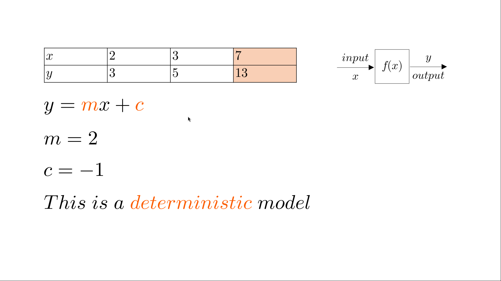
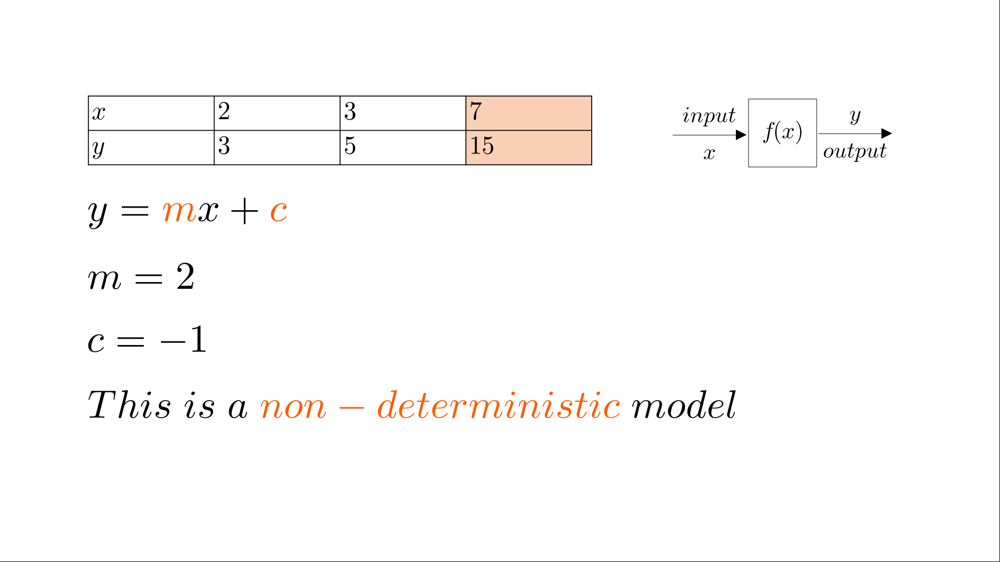
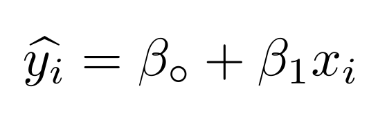
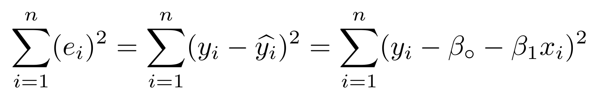
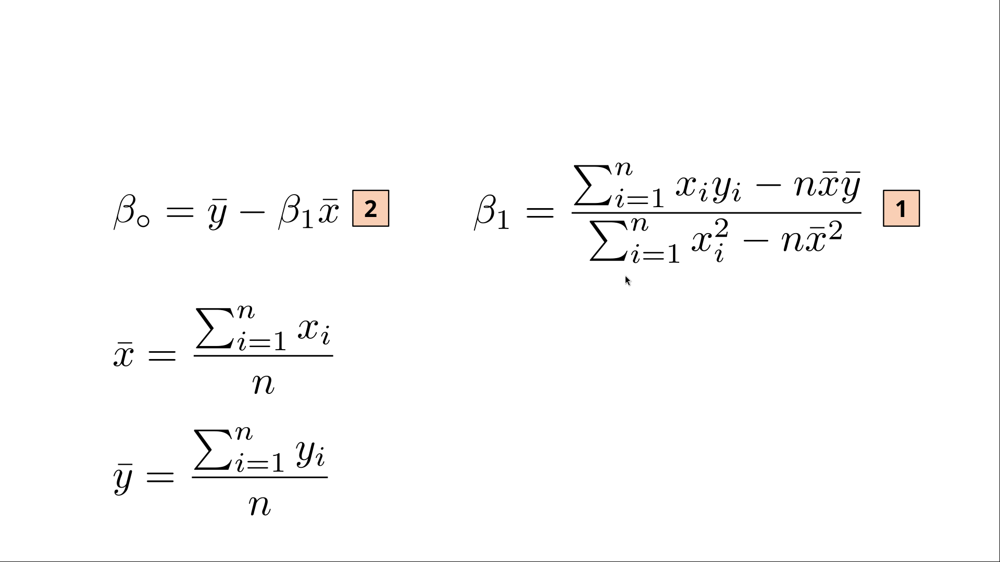
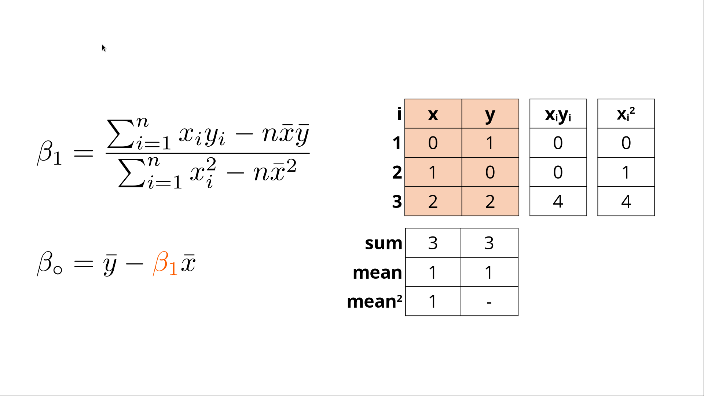
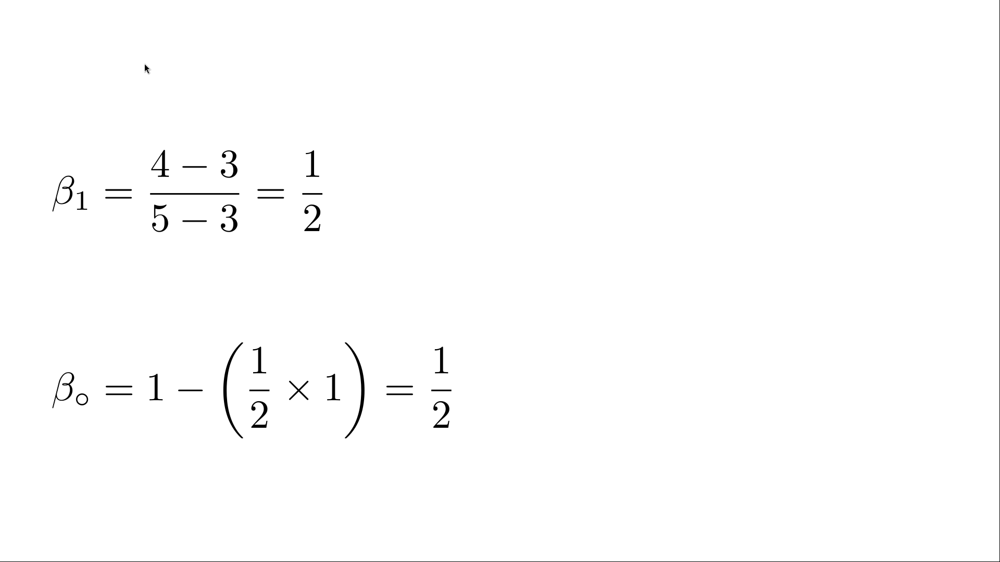
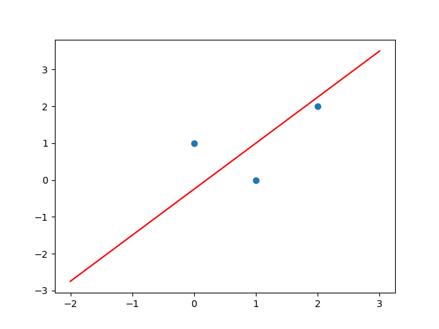
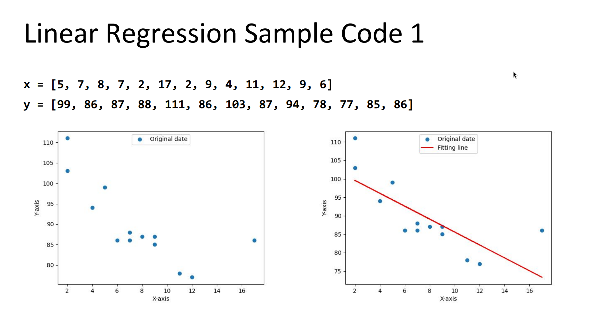
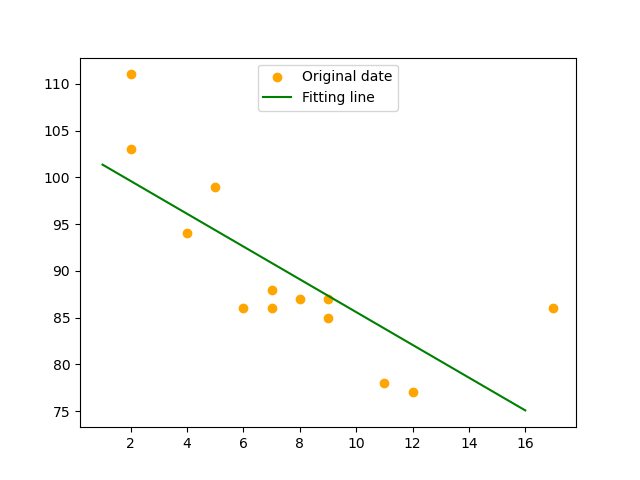

# Introduction
Machine Learning aims at _**training**_ a _**model**_ on a _**dataset**_ to _**predict**_ the outcomes.
# Machine Learning Models
A model is a mathematical representation of a given problem.
The goal is to find the **_parameters_** of the model. 

# Machine Learning Steps
## 1. Select a model
Simple Linear Regression  

## 2. Score function
Sum Squared Error (SSE)

## 3. Search Strategy 
Optimization technique without constrains to find β∘  and  β1.  

# Example 1
Given three points (0, 1), (1, 0) and (2, 2). Find β∘  and  β1 for a simple linear regression model.  

# Example 2
## 2.1 With SciPy
Recall [this example](https://github.com/qassasahmed/neural-networks-labs/blob/master/lab-1/linear-regression.py) from the introduction of **Neural Networks course Fall 2023-24**, We've used **Python's Scipy** to implement linear regression.

## 2.2 From scratch
Now, we've implemented [***linear regression from scratch***](https://github.com/qassasahmed/machine-learning/tree/main/lab-one/model.py), and we got the same result shown below.

# Thank You

