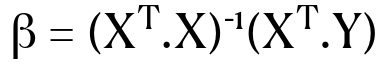
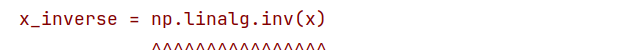
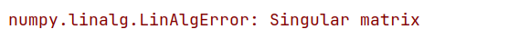
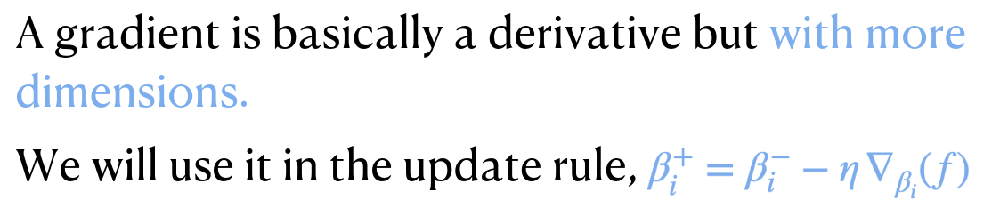
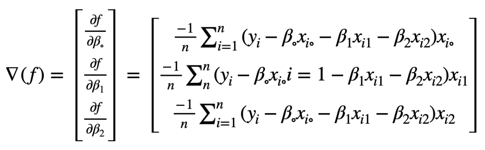

# Lab (3) Notes
Dr. Amr Amin  
Ahmed AL-Qassas
----
# Review
[//]: # (![img_2.png]&#40;img_2.png&#41;)
We have considered an **exact solution**, so that we can find the **Beta vector (β)**, and we got the equation below. However, it has a limitation:


# Limitation of Exact Solution (or Explicit Form)
Not all matrices have inverse. Check the code below or try it yourself [here](singular-matrix.py):
```python
import numpy as np

x = np.reshape([1, 2, 3, 11, 5, 9, 2, 4, 6], [3, 3])

"""
The reshape function gives a new shape to an array without changing its data.
"""
x_inverse = np.linalg.inv(x)
print(x_inverse)
```
when you run the code, the line `x_inverse = np.linalg.inv(x)` will raise the error below.    



###### A singular matrix determinant = 0, that's why it is non-invertible. Read more about [singular matrices](https://www.cuemath.com/algebra/singular-matrix/).  

# Gradient Method
To come over the limitations of the exact solution, we need a solution that does **not** depend mainly on the calculation of the **inverse**. The gradient is to the rescue **:"""D**

## What is the gradient?
A gradient is a **vector that points in the direction of the greatest rate of increase of a function**, and its magnitude is the **rate of increase in that direction**. It plays a crucial role in **optimization algorithms**, such as Gradient Descent. These algorithms are used to minimize a function (like a loss function) iteratively in order to find the model parameters that result in the least error.  Below is a simple example of how gradient descent might be used to minimize a function:

```python
def gradient_descent(x_start, learning_rate, num_iterations):
    x = x_start
    for _ in range(num_iterations):
        gradient = 2 * x  # derivative of x^2
        x -= learning_rate * gradient  # update x
    return x

# Call the function
result = gradient_descent(x_start=5, learning_rate=0.01, num_iterations=1000)
print(f"The minimum occurs at {result}")
```

In this example, we're trying to find the minimum of the function `f(x) = x^2` using gradient descent. The derivative of `f(x)` is `2*x`, which is the gradient. We start at `x=5`, and then iteratively move in the direction of the negative gradient to find the minimum of the function.
## What is the learning rate?
The learning rate in _gradient descent algorithms_ is a hyperparameter, meaning it is set before the learning process begins and does not change during training. **It determines the size of the steps taken in the direction of the negative gradient to find the minimum of the function.**

  

To find the gradient of each parameter, we use the formula below: 


###### note: x<sub>io</sub> always = 1.

Choosing the right learning rate is crucial. If it's too small, the algorithm will take a long time to converge to the minimum. If it's too large, the algorithm might overshoot the minimum and may even diverge, failing to find a good solution.

Remember, the optimal learning rate can depend on the specific problem, the dataset, and the specific variant of gradient descent you're using (batch, mini-batch, stochastic). It's often a good idea to experiment with different learning rates and strategies to find the best one for your specific case.

There are several strategies to choose a learning rate:

1. **Trial and Error**: Start with a small learning rate (like 0.001 or 0.01), run the algorithm, and see how well it performs. If it's too slow, try increasing the learning rate. If it's overshooting or diverging, try decreasing the learning rate.

2. **Learning Rate Schedules**: Some algorithms start with a high learning rate and then reduce it over time, allowing the algorithm to make big steps at first and then smaller steps as it gets closer to the minimum. This is called learning rate decay or annealing.

3. **Grid Search**: This is a more systematic approach where you train the model with various learning rates and choose the one that performs the best on a validation set.

4. **Adaptive Learning Rates**: Some optimization algorithms like AdaGrad, RMSProp, or Adam adjust the learning rate dynamically based on the recent steps.

# Example with Python
Fit the following data using the gradient method, given that score function is MSE. 
```
i	X1	X2	Y
1	31.5	6	21
2	36.2	2	25
3	43.1	0	18
4	27.6	2	30
```
The code [here](model.py) performs one iteration setting the learning rate to 4, which is unlikely to happen.   
```python
import numpy as np

np.set_printoptions(precision=2)

# Define the X
"""
x = np.array([[1, 31.5, 6],
              [1, 36.2, 2],
              [1, 43.1, 0],
              [1, 27.6, 2]])
"""
x = np.reshape([1, 31.5, 6, 1, 36.2, 2, 1, 43.1, 0, 1, 27.6, 2], [4, 3])

# Define the Y
# y = np.array([[21], [25], [18], [30]])
y = np.row_stack([21, 25, 18, 30])

# Initialise Beta vector
beta_vector = np.array([[0], [0], [0]])

# Assign 4 to the learning rate 'eta'
lean_rate = 4


# Define the update rule
def new_beta(b, eta, g):
    return b - eta * g.T


# Define the loss function
def mse(x, y, b):
    y_hat = np.dot(x, b)
    error = y - y_hat
    return error / len(y)


# Define the gradient function
def gr(err):
    b = -1 * np.dot(err.T, x)
    return b


error = mse(x, y, beta_vector)
gradient = gr(error)
beta_vector = new_beta(beta_vector, lean_rate, gradient)
print(f'beta vector on iteration #{1}:\n{beta_vector}')
```

The beta vector will be
```
beta vector after iteration #1:
[[  94. ]
 [3170.3]
 [ 236. ]]
```
# Thank You

