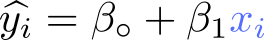
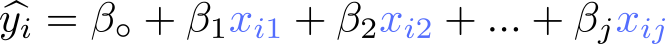
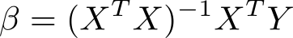
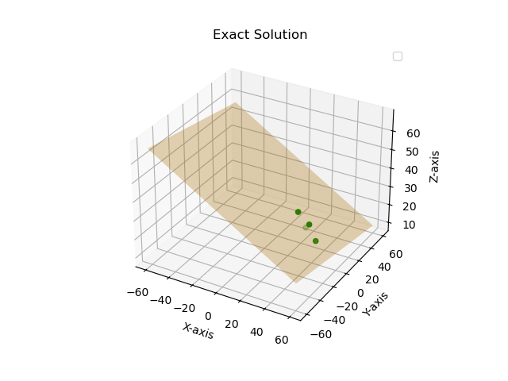
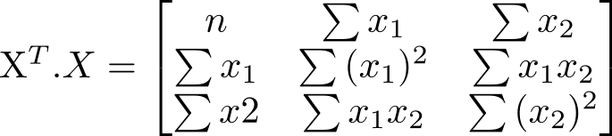
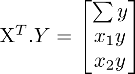

# Lab (2) Notes
Dr. Amr Amin  
Ahmed Al-Qassas
---
## Simple Linear Regression
In simple linear regression, there is _**only one independent variable**_ and one dependent variable.


## Multiple Regression
In multiple regression, there are **two or more independent variables** and one dependent variable.  
Considering an _**exact**_ solution, we can find the coefficients of independent variables, which are β.

  

For computation simplicity, we can represent the equations in the matrix form as:  


Our goal is to find the β vector which composes all coefficients. Hence, we need the β in the LHS.   
To use **X<sup>-1</sup>**, we first need to make sure that **X** is a square matrix. Recall that **X<sup>T</sup>.X** is always a square matrix. **X<sup>T</sup>.Y = X<sup>T</sup>.X.β**. We can now calculate the inverse of **(X<sup>T</sup>.X)**. Hence, the equation will be:  



## Steps to Find β vector (with Python)
**Problem**: Given the following table, Fit the data.

| i | X<sub>1</sub> | X<sub>2</sub> | Y  |
|---|---------------|---------------|----|
| 1 | 31.5          | 6             | 21 |
| 2 | 36.5          | 2             | 25 |
| 3 | 43.1          | 0             | 18 |
| 4 | 27.2          | 2             | 30 |
### 1. Determine X and y
We know that, **β = (X<sup>T</sup>.X)<sup>-1</sup>.X<sup>T</sup>.Y**. The **Y** vector is given. But the **X** as it is, is not complete.  
To build the **X** matrix, we need to remember that **β<sub>0</sub>** is a coefficient of an independent variable that always equals 1. We shall call this variable **X<sub>0</sub>**.  

To code the X matrix and Y vector in Python, we will use **numpy**. In numpy, each row of a matrix (or vector), is bounded by two square brackets **`[`** **`]`**. And, the whole matrix again is separated by **`[`** **`]`**.

```Python
import numpy as np


Y = np.array([[21],[25],[18],[30]])
X = np.array([[1, 31.5, 6], 
              [1, 36.5, 2], 
              [1, 43.1, 0], 
              [1, 27.2, 2]])
```

### 2. Find X<sup>T</sup>
The transpose of a matrix is obtained by swapping its rows and columns. You can use the numpy library to easily compute the transpose of a matrix using `np.transpose()`. Alternatively, you can use `matrix.T` attribute to get the transpose.

```Python
# Option 1:
X_transpose = np.transpose(X)
# Option 2:
X_T = X.T
```

### 3. Find (X<sup>T</sup>.X)<sup>-1</sup>
The inverse matrix of a square matrix **A** is a matrix that, when multiplied by **A**, gives the identity matrix **I**. To find the inverse matrix with numpy, we use `np.linalg.inv()`.

But, first, we need to calculate **(X<sup>T</sup>.X)<sup>-1</sup>**. To do that we can use `np.dot(X_T, X)`. Or, `X_T @ X`.

```Python
inverse = np.linalg.inv(X_T @ X)
```

### 4. Find (X<sup>T</sup>.Y)
```python
X_T_Y = np.dot(X_T, Y)
```

### 5. Find the coeffcients (β)
Finally, we can find the β vector by simply performing the following multiplication.
```python
Beta = inverse @ X_T_Y
```  
The figure below shows the **regression hyperplane** that fits the data considering an exact solution.  



### Some hints on how the outputs should be like
  


## How to calculate the inverse with calculator
