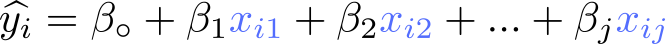

# Machine Learning Practical Exam Demo
## Spring 2023-24
# 1 Multiple Regression (5 points)
In multiple regression, there are **two or more independent variables** and one dependent variable. Considering an _**exact**_ solution, we can find the coefficients of independent variables, which are β.

For computation simplicity, we can represent the equations in the matrix form as:

Our goal is to find the β vector which composes all coefficients. Hence, we need the β in the LHS.To use **X-1**, we first need to make sure that **X** is a square matrix. Recall that **XT.X** is always a square matrix. **XT.Y = XT.X.β**. We can now calculate the inverse of **(XT.X)**.

**Question**: Considering an **Exact Solution**, use Python to find the β vector, given the following data:

| i | X1 | X2 | Y |
|---|---------------|---------------|---|
| 1 |               |               |   |
| 2 |               |               |   |
| 3 |               |               |   |
| 4 |               |               |   |

> Check [lab-2](../lab-2/model.py) (on GitHub) for the steps to find the β vector.

# 2 Support Vector Machine with SKlearn (5 points)
(1) Use `make_blobs()`to generate a random dataset with **100 samples** of **2 separable classes**. Then, (2) use the SVM **linear classifier** to classify the data with **no regularization**.
(3) **Fit the model** then (4) **find the support vectors** and (5) **the number of support vectors in each class**.

> Check [lab-6](../lab-6/svm.ipynb) (on GitHub) for the steps to create the dataset and classify it with svm.

> Bring your **laptop** to the exam with all packages installed.